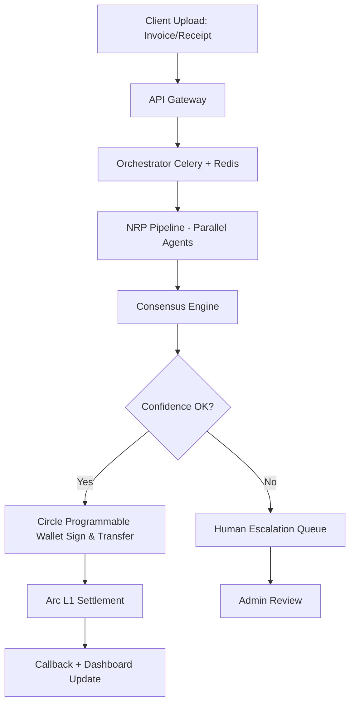

# SKT-ARC-CIRClE

**The Agentic Economy Operating System**  
**Developed by Shrijan Kumar Tiwari** | **SKT AI Labs**  
*Autonomous invoice perception, reasoning & USDC settlement using modular AI pipeline + Circle Programmable Wallets on Arc Network*

---

## 🌌 1. Project Vision

Traditional cross-border B2B payments face significant friction: multi-day settlement cycles (often 24-72 hours via SWIFT), high intermediary fees, manual reconciliation errors, and limited transparency. 

**SKT OMNI-ARC V49** is a production-oriented autonomous agent that transforms this process. It ingests invoices/receipts (via vision models), performs multi-stage reasoning for validation, compliance, and business logic, and executes settlements in **USDC** on **Circle’s Arc Network** — a stablecoin-native Layer-1 blockchain optimized for fast, low-cost financial coordination.

**Key Differentiators**:
- **Optimistic end-to-end latency**: Under 5 seconds for standard low-risk transactions (Arc testnet demonstrates ~0.5s finality; total time includes AI inference + compliance guards).
- **Cost efficiency**: Minimal on-chain fees + optimized AI routing — significantly lower than traditional correspondent banking rails.
- **Accuracy & Reliability**: Modular reasoning pipeline with consensus thresholds and rule-based safeguards; escalation to human review for high-value or flagged cases.
- **Autonomy**: Zero-touch workflow for eligible SME transactions, with full audit trails and callback notifications.

**Target Markets**:
- Indian SME exporters and importers
- Southeast Asian supply chain participants
- African and LATAM fintech-enabled B2B corridors
- Any business seeking faster working capital cycles using stablecoins

Arc Network (currently in public testnet as of 2026, with mainnet expected later this year) provides USDC as native gas token, deterministic finality, and emerging quantum-resistant features — making it suitable for institutional-grade stablecoin finance.

---

## 🛠 2. Core Architecture: Modular Neural Reasoning Pipeline (NRP)

OMNI-ARC avoids single-model dependency by using a **parallel, composable reasoning pipeline** with a lightweight consensus layer. This design balances speed, cost, and robustness.

### Reasoning Stages (Executed in parallel where possible):
1. **Vision & Extraction Engine** — Multimodal model (e.g., Gemini Flash series) for OCR, layout understanding, and data extraction from invoices/receipts/PDFs.
2. **Context & Merchant Auditor** — Cross-references merchant details, historical behavior, and basic legitimacy signals.
3. **Logical & Business Validator** — Amount matching, party verification, invoice terms consistency using larger reasoning models (e.g., Llama-3.1-70B class or equivalent).
4. **Compliance Guard** — Rule engine for sanctions screening, RBI cross-border guidelines, amount thresholds, and regulatory flagging.
5. **Currency & Routing Engine** — Real-time FX reference (where needed) and optimal settlement path via USDC on Arc.
6. **Security Sentinel** — Handles encryption, input sanitization, and rate limiting.
7. **Circle Wallet Integrator** — Uses Programmable Wallets (developer-controlled) for secure transaction signing.
8. **Arc Network Relayer** — Broadcasts signed transactions to Arc L1 for settlement.
9. **Final Verification Node** — Generates audit log, confidence score, and UI/dashboard callback.

**Consensus Mechanism**: Weighted voting across models with configurable confidence thresholds. If score falls below threshold → automatic escalation to human-in-the-loop queue.

**High-Level System Flow (Mermaid-style for GitHub rendering)**:



---

## 📊 3. Performance Comparison (Realistic Benchmarks)

| Metric                    | Traditional SWIFT          | Ripple ODL                  | Stablecoin Rails (General) | SKT OMNI-ARC (Target)          |
|---------------------------|----------------------------|-----------------------------|----------------------------|--------------------------------|
| Settlement Time          | 24-72 hours               | 3-10 seconds               | Seconds to minutes        | <5s optimistic (AI + compliance) |
| All-in Cost              | $15–50 + FX spread        | ~0.002 + liquidity cost    | 0.1–0.5%                  | Near-zero on-chain + AI cost   |
| 24/7 Availability        | Limited                   | High                       | High                      | High (with escalation)         |
| Automation Level         | Low (manual reconciliation)| Medium                     | High                      | High with consensus + guards   |
| Auditability             | Moderate                  | High                       | High (on-chain)           | Full on-chain + AI logs        |

*Note: Actual performance depends on network conditions, compliance complexity, and Arc mainnet finality. Arc testnet has shown strong sub-second capabilities.*

---

## 📁 4. Repository Structure

```text
SKT-OMNI-ARC-V49/
├── src/
│   ├── main.py                    # Gradio dashboard + main orchestrator
│   ├── agents/ # No Need so removed
│   │   ├── vision_extractor.py
│   │   ├── compliance_guard.py
│   │   ├── logical_validator.py
│   │   └── consensus_engine.py
│   ├── integrations/
│   │   ├── circle_wallet.py       # Programmable Wallets SDK
│   │   └── arc_relayer.py         # Arc L1 interaction
│   ├── utils/ # Same Logic add in main.py
│   │   ├── security.py
│   │   └── logging.py
│   └── config.py
├── templates/ # Html                ├── requirements.txt
└── README.md
```

---

## 🧪 5. Installation & Local Development

### Prerequisites
- Python 3.10+
- Circle Developer Account (Programmable Wallets enabled)
- Arc Testnet access (USDC faucet available)
- Gemini / Google AI Studio API key (or compatible multimodal provider)
- Redis (for Celery task queue in production-like setup)

### Quick Start
```bash
git clone https://github.com/shrijanagain/Circle.git   # Replace with your actual repo URL
cd SKT-OMNI-ARC-V49

pip install -r requirements.txt

# Setup environment
cp .env.example .env
# Edit .env with:
# GEMINI_API_KEY=...
# CIRCLE_API_KEY=...
# CIRCLE_ENTITY_SECRET=...   # Use Circle's encrypted entity secret pattern
```

### Run Development Server
```bash
python src/main.py
```

Dashboard available at `http://127.0.0.1:7860`

**Security Note**: Never commit secrets. Use Circle’s **Entity Secret Ciphertext** mechanism for developer-controlled wallets. In production, rotate keys and use secret management (e.g., AWS Secrets Manager or HashiCorp Vault).

---

## 6. Sample Code Snippets

**Example: Circle Wallet Integration (src/integrations/circle_wallet.py)**
```python
from circle_sdk import CircleClient  # Hypothetical / actual SDK import

def create_developer_controlled_wallet(entity_secret_ciphertext: str):
    client = CircleClient(api_key=os.getenv("CIRCLE_API_KEY"))
    wallet = client.wallets.create(
        wallet_type="developer_controlled",
        entity_secret_ciphertext=entity_secret_ciphertext
    )
    return wallet.id

def execute_usdc_transfer(wallet_id: str, destination_address: str, amount: str):
    # Amount in USDC atomic units
    transfer = client.transfers.create(
        source_wallet_id=wallet_id,
        destination_address=destination_address,
        token="USDC",
        amount=amount,
        blockchain="ARC"  # or appropriate chain identifier
    )
    return transfer
```

**Consensus Engine Snippet (simplified)**
```python
def run_consensus(results: dict, threshold: float = 0.85):
    weighted_score = sum(score * weight for score, weight in results.values())
    if weighted_score >= threshold:
        return "APPROVED", weighted_score
    return "ESCALATE", weighted_score
```

---

## 7. API Specification (Key Endpoints)

**POST /api/v1/settle-invoice**
- **Request Body** (JSON):
  ```json
  {
    "invoice_file": "base64_or_url",
    "merchant_id": "string",
    "expected_amount": "decimal",
    "destination_wallet": "0x..."
  }
  ```
- **Response**:
  ```json
  {
    "transaction_id": "string",
    "status": "PROCESSING | COMPLETED | ESCALATED",
    "settlement_time_ms": 3200,
    "arc_tx_hash": "0x...",
    "confidence_score": 0.92
  }
  ```

Rate limiting, JWT auth, and request validation applied at API Gateway layer.

---

## 🔒 8. Security & Compliance Framework

**Key Protections**:
- **Wallets**: Circle Programmable Wallets with developer-controlled model + Entity Secret handling.
- **Data Encryption**: AES-256 at rest/transit for sensitive fields; input sanitization against injection.
- **Threat Model**:
  - Server compromise: Funds protected by Circle wallet controls (no direct private key exposure).
  - Model poisoning / adversarial inputs: Multi-model consensus + rule-based guards.
  - DDoS / Abuse: Rate limiting + monitoring.
- **Quantum Readiness**: Alignment with Arc’s post-quantum signature roadmap (opt-in features expected at mainnet).

**Regulatory Mapping (India-focused)**:
- Alignment with RBI guidelines for faster cross-border inward payments (prompt crediting, reconciliation).
- Basic sanctions & AML screening hooks (expandable to full KYC/AML pipelines).
- Support for e-mandate rules where recurring flows are involved.
- Audit logs designed for regulatory reporting.

Full production deployment will include SOC2-aligned controls and detailed mapping to applicable frameworks.

---

## 9. Deployment Architecture

**Local / Edge**: Docker + docker-compose for single-node testing.

**Production Recommendation**:
- Orchestration: Kubernetes (EKS/GKE) with Celery workers
- API Gateway: Kong or AWS API Gateway
- Monitoring: Prometheus + Grafana
- CI/CD: GitHub Actions → build → test → deploy
- Scaling: Auto-scale reasoning workers based on queue depth

Sample `Dockerfile` snippet available in repo.

---

## 📈 10. Roadmap (2026–2027)

- **Q2 2026**: Enhanced prototype with real Arc testnet settlements and improved compliance module.
- **Q3 2026**: Multi-chain support exploration (via Circle CCTP where applicable) + advanced analytics dashboard.
- **Q4 2026**: Selective open-sourcing of non-core components (e.g., consensus framework) and pilot with Indian SMEs.
- **2027**: Sovereign AI ecosystem tools for broader adoption in export corridors.

---

## 🎥 11. Demo & Technical Highlights

Our demo showcases the agent processing a real-world merchant receipt (e.g., Barcelos), extracting data, running the full reasoning pipeline, and completing a Circle + Arc settlement flow with visible dashboard updates.

**Key moments in the video**:
- Instant vision capture and data extraction
- Real-time system status (green indicators)
- Action execution via Circle wallet (example wallet prefix shown)
- Near real-time confirmation

**[▶️ Watch Demo on YouTube](https://youtu.be/AlQQW0dr3Ec)**

---

## 👥 12. Team & Leadership

**SKT AI Labs** is a family-driven technical initiative focused on practical AI applications for financial inclusion and efficiency:

- **Lead Developer & Architect**: Shrijan Kumar Tiwari
- **Project Coordination**: Sakshi Tiwari
- **Strategy & Governance**: Lokesh Kumar Tiwari
- **Operations**: Kiran Mishra

We welcome constructive feedback and collaboration from the developer community on technical aspects.

---

